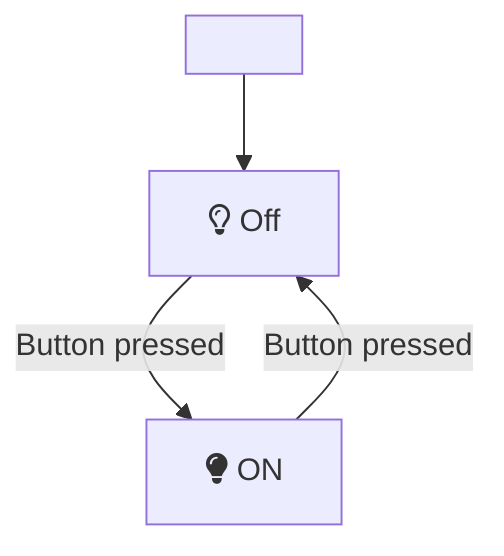
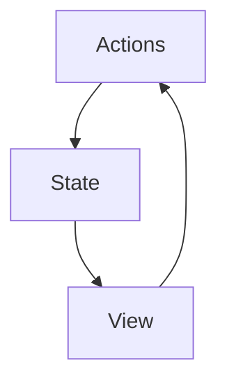
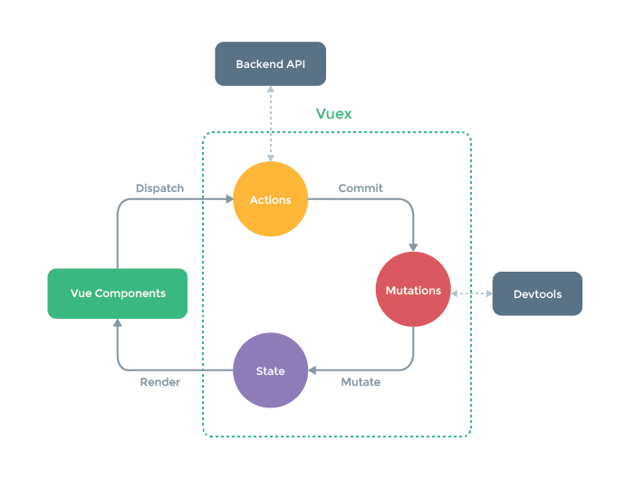

# State

## State Machines

## Patrón FLux

Datos almacenaos de forma agnostica a como se consimen

El **estado** sufre mutaciones por medio de **eventos**

### State

Datos estructurados agnosticos a la vista

### View

Lo relacionado a la muestra del estado o representación visual

### Actions

Eventos que surgen desde la vista y mutan el estado

